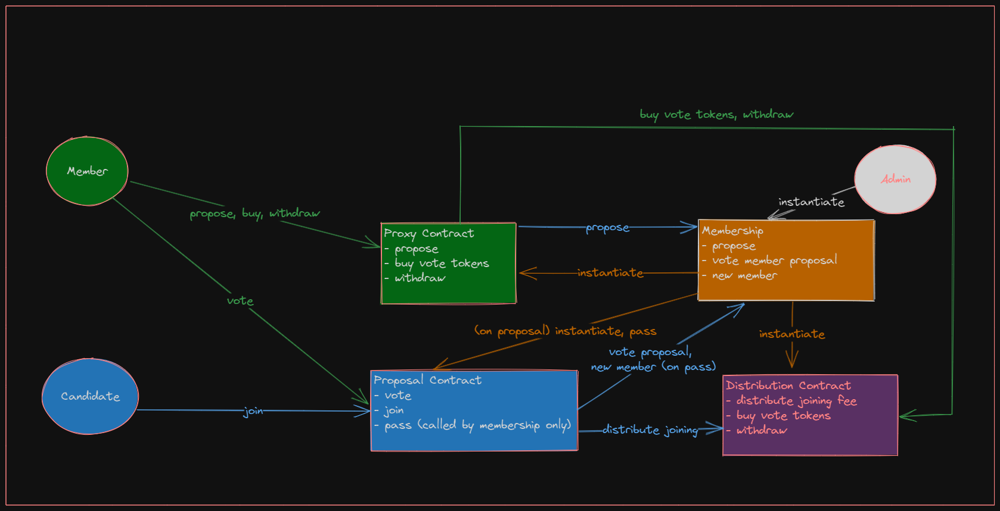

# Multi Contract Course Test
[Problem Statement](https://hackmd.io/@hashed/r1u5lkpB3)

I have restricted the solution to *Member Proposals only*. 
This is purely due to lack of time. I feel the solution needs a lot more time to support both:
- Generic Proposals
- Members Proposals

However, with the level of completeness of my solution, multi-test effort, utliziing all features taught in the course, I am pretty confident you will find me solution credible for the test/certification.

The solution utlizes following features that were taught in the course:
* Practices with respect to Multi Contracts
* Instantiation of contracts from other contracts
* Project Layout with common types
* Inter contract communication 
    - sub_msg - reply
    - smart queries
* MultiIndexMap
* Sample test flows using multi test across all contracts
* Helper multitest modules within contracts to assist testing
* Constant time distribution principles and ability to withdraw on own gas fees
* Error handling principles

# Tests
Tested full voting cyle for member proposals in
[Membership Contract multitest/tests module](./contracts/membership/src/multitest/tests.rs)

## Example Flow from the test script
```
joining_fee is 100 ATOM. There is proposal to add candidate to the protocol. member1 assigned 5 votes to that voting, member2 assigned 3 votes to that voting, and member3 assigned 2 votes to that voting. There are 19 vote tokens in total in the system, so the voting passes. member1 can pay 100 ATOM to join the system, and it is distributed: member1 gets 50 ATOM, member2 gets 30 ATOM, member3 gets 20 ATOM.
```

## Additional test flow
```
System is bootstrapped with two members alice and bob each having 5 vote tokens. Total 10 vote tokens in circulation. there is a proposal from alice to add charlie to the protocol she contributes 3 vote tokens. later bob votes on proposal with 3 vote tokens. proposal is passed, charlie joins and pays joining fee of 30 atoms. Alice gets 15 ATOMs which she happily withdraws.
Bob buys `3` vote tokens instead with token price of 5 atoms per vote token. charlie when joined as a member he got total of 6 vote tokens as initial votes. 
```

# Solution
Total of four contracts:
1. membership (core)
2. distribution (internal)
3. proxy for each member
4. proposal for candidate



Note: In the solution when 
* user withdraws, system will credit all of its rewads to its account address.
* user buys vote tokens, system will credit vote tokens worth all its rewards to its account address.

It should be relatively easy to buy/withdraw an explicit amount. Left for futre.

# Script from the test
## Members
System members are accouts eligible to both vote, and propose votings. Every member has assigned `vote_tokens` which they can use to vote on proposals.


## Add member proposals
Any member can add a proposal to add a new member. To create a proposal, user chooses how much `vote_tokens` he want to use - those tokens are immediately remoted from his balance and assigned to the yes vote for this proposal.

Every proposal should be a separate contract instatiation, and it would be used for voting.

## Voting on the proposal
Any member can assign arbitrary amount of `vote_tokens` to the proposal, which means voting “yes”. `vote_tokens` are immediately removed from the pool.

## Closing the add member proposal
If at any time `vote_tokens` assigned to the “yes” vote on this proposal is more than half of total `vote_tokens` in the system, the proposal passes.

## Joining to the system
Account which is to be added to the system via add member proposal, can call the join message to this proposal to join the protocol. `joining_fee` should be paid with this execution, which is immediately distributed along whoever voted “yes” on this proposal, proportionally to number of `vote_tokens` he allocated on the vote. `joining_fee` should be configured in protocol instantiation.

When user joins the system, he gets `initial_votes` amount of `vote_tokens` for start.

## Withdrawal funds
User an withdraw any amount of rewards he got for voting so far.

## Buying vote_tokens
User can use the rewards to buy new vote_tokens. Instead of withdrawing funds, he can decide to assign it to the new tokens with vote_token_price per token.

When it is done, all the reward he used to buy tokens should be send to owner_addr which is set on system instantiation.